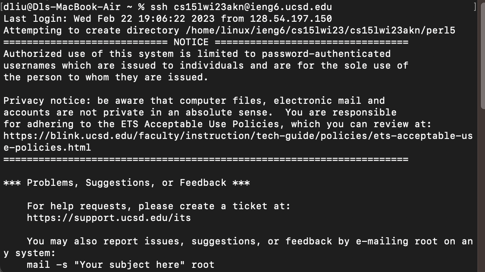
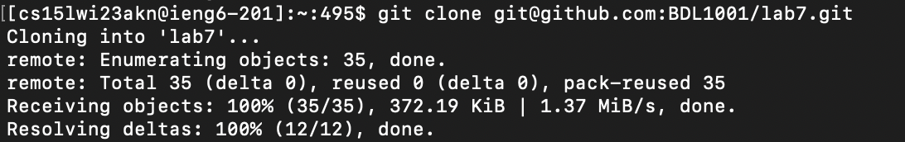
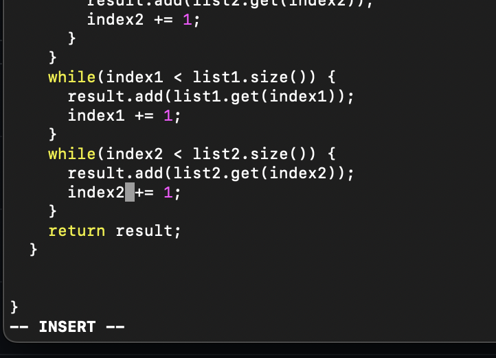
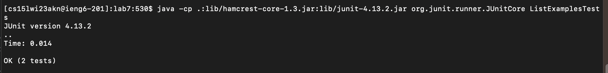
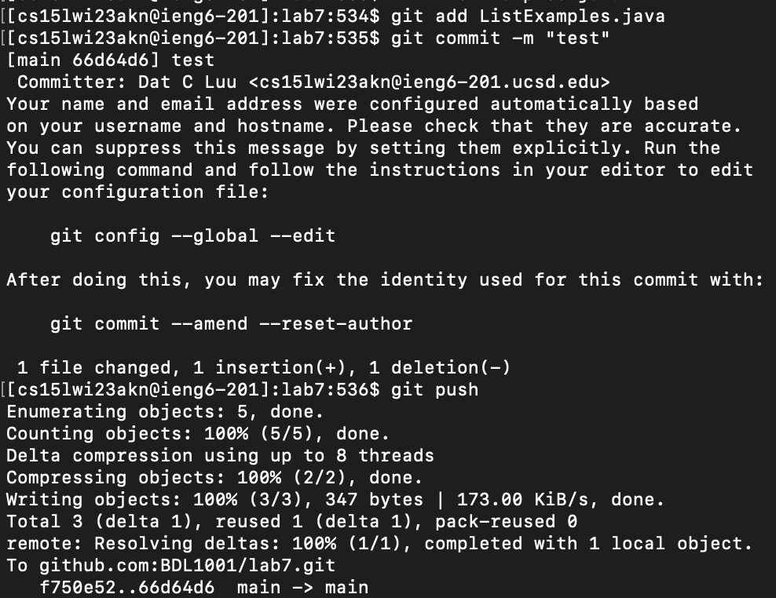

## Step 4 (*ssh* into ieng6)


```
<up><enter>
```
- The above screenshot is me logging into ieng6 using *ssh*
- The command *ssh cs15lwi23akn@ieng6.ucsd.edu* was the first thing on my local machine's history to I used the up arrow only once

## Step 5 (Cloning fork)


```
<command><c> (Copied fork link)
<command><v> (Pasted fork link)
git clone git@github.com:BDL1001/lab7.git
<enter>
```
- I forked the lab7 repo by going to [Lab7 Repo](https://github.com/ucsd-cse15l-w23/lab7)
- I then pasted the *ssh* address to my fork and used *git clone* to clone my fork to ieng6

## Step 6 (Run Tests)


```
cd l
<tab>
<up><up><up><up><up><up><up><up>
javac -cp .:lib/hamcrest-core-1.3.jar:lib/junit-4.13.2.jar *.java
<enter>
<up><up><up><up><up><up><up><up>
java -cp .:lib/hamcrest-core-1.3.jar:lib/junit-4.13.2.jar org.junit.runner.JUnitCore ListExamplesTests
<enter>
```
- I typed only *cd l* then clicked tab in order to quickly autofill the directiory name to lab7
- I change into the lab7 directory to run the given JUnit tests
- In order to compile the java files in the directory using javac I had to press the up arrow 8 times because javac was 8 up on my ieng6's history
- Then to run the test using java I also had to press the up arrow 8 times because it was 8 up on my ieng6's history after using javac

## Step 7 (Edit code)



```
vim L
<tab>
vim ListExamples.java
<enter>
```
- I typed only *vim L* then clicked tab to autofill, however it only autofilled to *vim ListExamples.* because there are two files with that name (a .java file and a .class file)
- So I manually had to type java afterwards to edit ListExamples.java with the text editor *vim*

## Step 8 (Run tests after edit)


```
<up><up><up>
javac -cp .:lib/hamcrest-core-1.3.jar:lib/junit-4.13.2.jar *.java
<enter>
<up><up><up>
java -cp .:lib/hamcrest-core-1.3.jar:lib/junit-4.13.2.jar org.junit.runner.JUnitCore ListExamplesTests
<enter>
```
- I pressed the up arrow because javac was 3 up on my history from the previous steps
- Then upon compiling the java files again, I pressed the up arrow 3 times again to get to the java command to run the tests again because it was 3 up on my history

## Step 9 (Commit and push changes)


```
git add L
<tab>
git add ListExamples.java
<enter>
git commit -m "test"
<enter>
git push
<enter>
```
- I typed *git add L* and then typed tab to autofill the file name to ListExamples and typed java to specify that I want to add the java file not the class file
- Then I *typed git commit -m "test"*. My commit message is "test" simply to speed things up
- Then I typed *git push* to push my commit which sends my changes to my fork/repository
